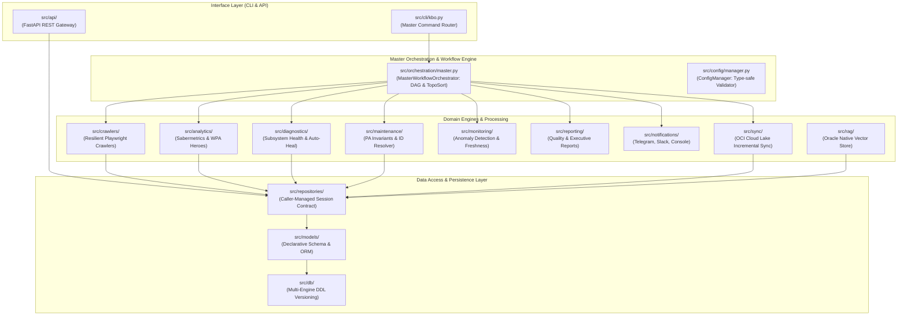

# KBO Playwright Platform Architecture Blueprint

## 1. Executive Summary & Core Principles
The **KBO Playwright Data & Analytics Platform** is an enterprise-grade sports data engineering ecosystem designed for high-concurrency scraping, real-time event processing, advanced sabermetric analytics, automated quality gates, and hybrid database synchronization (SQLite $\rightarrow$ Oracle Autonomous Database with native Vector RAG).

### Core Architectural Contracts:
1. **Repository Transaction Contract**: All data access repositories (`src/repositories/`) accept caller-provided SQLAlchemy `session: Session` and NEVER commit, rollback, or instantiate sessions internally. Transactions are owned by CLI orchestrators or service context managers (`get_db_session()`).
2. **Master Workflow DAG**: All multi-stage batch pipelines are structured as Directed Acyclic Graphs (`src/orchestration/`) with topological sorting, failure cascades, and safe skips.
3. **Multi-Tier ProcessLock Hierarchy**: Concurrency between high-frequency live jobs, core daily pipelines, and long-running maintenance is strictly governed by `LIVE_LOCK`, `DAILY_LOCK` (ForceProcessLock), and `MAINTENANCE_LOCK`.
4. **Master CLI Command Router**: Every platform domain is uniformly accessible via `python3 -m src.cli.kbo <subcommand>` or `python3 -m src.cli <subcommand>`.

---

## 2. Multi-Layer Domain Architecture



---

## 3. The 10 Platform Subsystems

| Subsystem | Module Path | Purpose & Key Features |
| :--- | :--- | :--- |
| **Master Orchestrator** | `src/orchestration/` | DAG workflow definition, topological sorting, dependency checks, dry-run simulation. |
| **Config & Environment** | `src/config/` | Type-safe settings loader, environment validation gates, secret masking (`***`), feature flags. |
| **Advanced Analytics** | `src/analytics/` | wOBA, wRC+, FIP, WAR, Leverage Index (LI), WPA win-probability calculations. |
| **System Diagnostics** | `src/diagnostics/` | Multi-subsystem health auditing (DB, Scheduler, Crawlers, Pipeline, RAG) with auto-heal. |
| **Maintenance Engine** | `src/maintenance/` | PA formula auditing ($PA = AB + BB + HBP + SH + SF$), NULL player ID backfills, WAL checkpoints. |
| **Anomaly Detection** | `src/monitoring/` | Statistical Z-score time-series outlier detection, table freshness delays, selector drift alerts. |
| **Executive Reporting** | `src/reporting/` | Multi-format (Markdown, HTML, JSON) quality gate, gap analysis, and executive dashboard reports. |
| **Notification Router** | `src/notifications/` | Multi-channel dispatch (Telegram, Slack, Console) with alert storm deduplication. |
| **OCI Sync & Data Lake** | `src/sync/` | Incremental Oracle Autonomous DB sync using native MERGE bulk upserts. |
| **Synthetic Generator** | `src/testing/` | Realistic KBO scenario and synthetic data generation for deterministic end-to-end testing. |

---

## 4. Master CLI Reference (`src.cli.kbo`)

The unified CLI provides command-line dispatch for all platform tasks:

```bash
# 1. Execute Master Workflow DAG
python3 -m src.cli.kbo workflow --workflow daily_sync --dry-run
python3 -m src.cli.kbo workflow --workflow historical_recovery --date 20241015

# 2. System Diagnostics & Self-Healing
python3 -m src.cli.kbo diagnose --subsystem all --json
python3 -m src.cli.kbo diagnose --subsystem database --fix

# 3. Quality & Executive Reports
python3 -m src.cli.kbo report --category all --format markdown
python3 -m src.cli.kbo report --category executive --output report.html --format html

# 4. Database Maintenance & Invariant Fixes
python3 -m src.cli.kbo maintenance --task pa_audit --year 2025 --apply
python3 -m src.cli.kbo maintenance --task null_player_ids --apply

# 5. Environment & Secret Configuration Audit
python3 -m src.cli.kbo config --env production --strict

# 6. Multi-Channel Notification Dispatch
python3 -m src.cli.kbo notify --channel telegram --title "Deploy Success" --body "Daily sync finished." --priority high

# 7. Database Migrations
python3 -m src.cli.kbo migrate --dialect oracle --status
python3 -m src.cli.kbo migrate --dialect oracle --dry-run

# 8. Synthetic Data Seeding
python3 -m src.cli.kbo seed --season 2026 --games-per-team 5 --json

# 9. Anomaly Detection
python3 -m src.cli.kbo detect --sensitivity medium --json

# 10. OCI Cloud Lake Synchronization
python3 -m src.cli.kbo sync --apply --mode incremental --verify
```

---

## 5. Security & Verification Baseline
- **Linting & Code Quality**: 100% compliant with `ruff check src/ tests/ scripts/` (0 errors).
- **Test Coverage**: 9,970+ automated tests executed in parallel with 0 regressions.
- **Transaction Safety**: All modifications use explicit context-managed transactions with full rollback guarantees.
