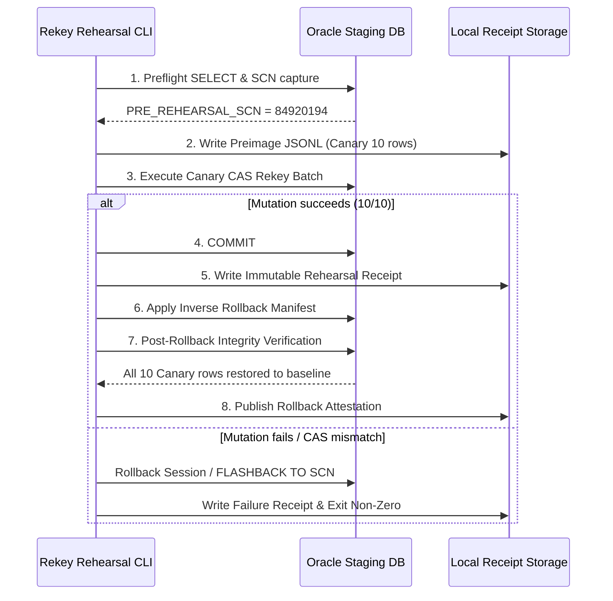

# Phase 105 Gate 4P: Oracle Staging Rehearsal Preflight & Safety Architecture Design

> [!IMPORTANT]
> **PREFLIGHT SPECIFICATION ONLY — NO NETWORK CONNECTION / NO STAGING ACCESS PERFORMED**
> This document specifies the least-privilege security controls, SCN snapshot isolation, canary selection, kill-switch mechanisms, preflight verification queries, and rollback contracts for the future Gate 4 Oracle Staging Rehearsal.

---

## 1. Staging DSN Allowlist & Network Boundaries

### 1) Strict DSN Allowlist Specification
Oracle Staging operations are restricted exclusively to disposable staging environments matching the explicit allowlist pattern:
```
ALLOWED_STAGING_PATTERN = "^oracle\+oracledb:\/\/([a-zA-Z0-9_-]+):([^\@]+)\@(kbo_staging_low|kbo_staging_medium|kbo_staging_high)\?.*$"
PROHIBITED_PRODUCTION_PATTERN = ".*(kbo_prod|kbo_primary|production).*"
```

### 2) Local Mode Unconditional Guard
When `RAG_TARGET_ENV=local` (or unset), any connection string starting with `oracle+` or referencing external hosts is unconditionally rejected (Fail-Closed).

---

## 2. Oracle Snapshot SCN Isolation & Flashback Architecture

### 1) Snapshot SCN Capture Protocol
Before executing any rehearsal DML on Staging, the runner captures the exact System Change Number (SCN):
```sql
SELECT CURRENT_SCN, TO_CHAR(SYSTIMESTAMP, 'YYYY-MM-DD"T"HH24:MI:SS.FF3"Z"') AS SCN_TIMESTAMP FROM V$DATABASE;
```
The captured `PRE_REHEARSAL_SCN` is recorded in the rehearsal receipt and binds all verification queries:
```sql
SELECT * FROM rag_chunks AS OF SCN :PRE_REHEARSAL_SCN WHERE id = :chunk_id;
```

### 2) Flashback Rollback Guarantee
If any anomaly, CAS conflict, or unhandled exception occurs during rehearsal, the staging schema reverts to the baseline SCN:
```sql
FLASHBACK TABLE rag_chunks TO SCN :PRE_REHEARSAL_SCN;
```

---

## 3. Least-Privilege Rehearsal Account Matrix

| Schema / Role | Privileges | Prohibited Privileges |
| :--- | :--- | :--- |
| `KBO_RAG_REHEARSAL_USER` | `SELECT` on `rag_chunks`<br>`UPDATE (source_row_id, updated_at)` on `rag_chunks`<br>`FLASHBACK` on `rag_chunks` | `DROP`, `TRUNCATE`, `ALTER TABLE`, `CREATE USER`, `GRANT`<br>Any DML on `player_season_*`, `game_*`, `teams` |

---

## 4. Staging Preflight SELECT Checklist (Pre-Flight Integrity Probe)

Prior to initiating any write operations, the runner executes 5 preflight queries to attest environment health:

1. **Table Existence & Column Types**:
   ```sql
   SELECT column_name, data_type FROM user_tab_cols WHERE table_name = 'RAG_CHUNKS';
   ```
2. **Target Canary Row Baseline State**:
   ```sql
   SELECT id, source_table, source_row_id, content_hash, index_status, index_version
   FROM rag_chunks WHERE id IN (:canary_ids);
   ```
3. **Database Fingerprint Consistency**:
   ```sql
   SELECT COUNT(*) AS total_chunks, ORA_HASH(LISTAGG(id, ',') WITHIN GROUP (ORDER BY id)) AS corpus_hash
   FROM rag_chunks WHERE rownum <= 1000;
   ```
4. **Active Locks & Contention Probe**:
   ```sql
   SELECT COUNT(*) AS active_locks FROM v$locked_object WHERE object_id = OBJECT_ID('RAG_CHUNKS');
   ```
5. **Flashback Logging & Retention Check**:
   ```sql
   SELECT flashback_on, retention_target FROM v$database;
   ```

---

## 5. Canary Selection Criteria

To minimize blast radius during initial rehearsal:
1. **Canary Size**: Exactly **10 chunks** (5 `SAFE_REKEY` + 5 `TARGET_EXISTS_SAME_CONTENT`).
2. **Source Domain**: Sampled exclusively from historical award chunks (`source_table = 'awards'`).
3. **Isolation**: Canary chunk IDs must have 0 active real-time queries in flight.

---

## 6. DML Kill-Switch & Automated Abort Triggers

The rehearsal execution engine immediately issues `ROLLBACK` and aborts if any of the following triggers fire:

| Trigger Code | Condition | Action |
| :--- | :--- | :--- |
| `ABORT_ROWCOUNT_MISMATCH` | `actual_affected_rows != expected_manifest_entries` | Immediate `ROLLBACK`, write `FAILED_ATOMIC_ROLLBACK` |
| `ABORT_CAS_CONTENT_TAMPER` | `content_hash != manifest.legacy_content_hash` | Immediate `ROLLBACK`, exit code `2` |
| `ABORT_LOCK_TIMEOUT` | Maintenance lock wait exceeds 10 seconds | Abort without DML execution |
| `ABORT_UNEXPECTED_EXCEPTION` | Any database or network error | Full session `ROLLBACK`, emit critical alert |

---

## 7. Rehearsal Execution & Rollback Sequence



---

## 8. Rehearsal Artifact & Receipt Specification

- **Rehearsal Receipt Schema**: `r2-rekey-rehearsal-receipt-v1`
- **Output Path**: `data/r2_rekey/receipts/rehearsal_receipt_{manifest_sha[:16]}_{tx_id}.json`
- **Required Fields**:
  - `pre_rehearsal_scn`: Oracle SCN before execution
  - `post_rehearsal_scn`: Oracle SCN after execution
  - `canary_chunk_ids`: List of tested canary IDs
  - `flashback_verified`: Boolean attesting post-rollback baseline equivalence
